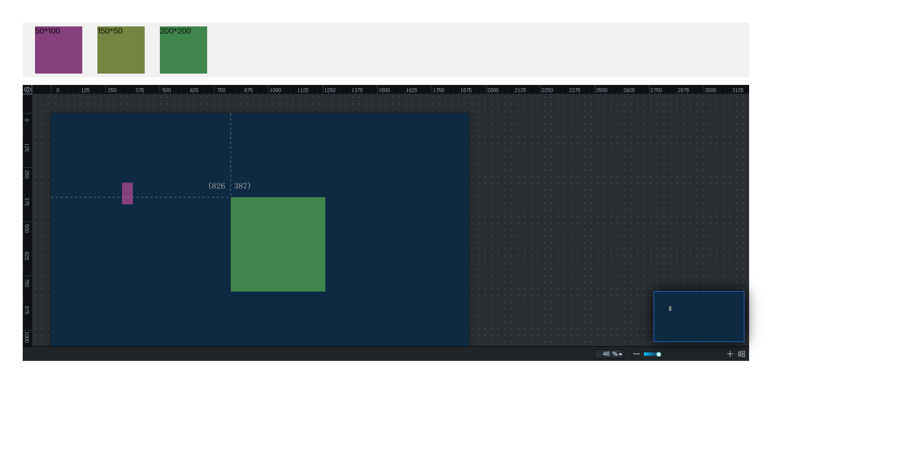

## DevBoard

### 介绍

用于构建二次开发场景的组件配装面板。支持 React。



### 文档

#### 安装使用

```bash
npm install react-lc-panel
or
yarn add react-lc-panel
```


```tsx
Import Panel from 'react-lc-panel';

function App() {
	return <Panel />
}
```


#### API

| 属性             | 说明                       | 类型                                        | 默认值  |
| ---------------- | -------------------------- | ------------------------------------------- | ------- |
| enableDrag       | 是否响应拖入动作           | boolean                                     | true    |
| enableLineHelper | 是否开启辅助线             | boolean                                     | false   |
| screenWidth      | 画布宽度                   | number                                      | 1920    |
| screenHeight     | 画布高度                   | number                                      | 1080    |
| screenBGColor    | 画布背景色                 | string                                      | #0d2a42 |
| screenBG         | 画布背景图                 | string                                      | —       |
| zoom             | 缩放比例                   | number                                      | —       |
| makeCustomized   | 缩略图                     | `TDragPos[]`                                | —       |
| dragTarget       | 拖拽目标的坐标             | `TDragPos`                                  | —       |
| onDragEnd        | 拖入动作完成后的回调       | `（p: dropPos，t: boolean) => void`         | —       |
| onChasingLine    | 拖入目标与辅助线贴近的回调 | `(p: {left: number, top: number}) => void`  | —       |
| onChangeZoom     | 画布缩放比例改变的回调     | `(m: {zoom: number, unit: number}) => void` | —       |

#### 案例

通过 `npm` start 本地运行并访问 http://localhost:8080/

Online example: https://alindas.github.io/devBoard/

#### 问题
1. 放大后，面板水平方向的滚动通过按住 `shift` 滚动查看
2. [其他问题](https://github.com/alindas/devBoard/issues/new)

